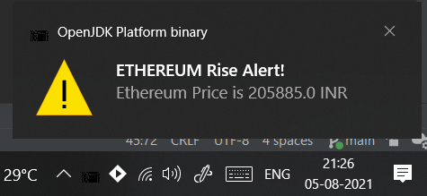
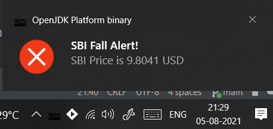

# investment_notifier

A small core Java CLI Application that shows Desktop notifications any time a specified Stock or Crypto price rises 
above a threshold or falls below another threshold value.

## Usage

**Method 1:**  Modify the code directly to add your Stock or Crypto of interest, and run.

**Method 2 (CLI Usage):**

1. To add Crypto to watchlist: `investment_notifier c_<Crypto Code> <Crypto Name> <Lower threshold> <Upper Threshold>`.

2. To add Stock to watchlist: `investment_notifier s_<Stock Code> <Stock Name> <Lower threshold> <Upper Threshold>`.

3. To add Stock and then a Crypto to watchlist: `investment_notifier s_<Stock Code> <Stock Name> <Lower threshold> <Upper Threshold> c_<Crypto Code> <Crypto Name> <Lower threshold> <Upper Threshold>`.

4. Mix and match with as many Cryptos and Stocks as desired, keeping the proper format in mind. 

### APIs Used

1. [CoinGecko CryptoCurrency Price Tracking API](https://www.coingecko.com/en/api/)

2. [AlphaVantage Stock Data Tracking API](https://www.alphavantage.co/documentation/), which only supports USD prices
as of now, unfortunately.

3. `java.awt.*` for Desktop Notifications, and various other Core Java Utilities.

### Screenshots

| CryptoCurrency Price Notification | Stock Price Notification |
| --- | ---- |
|  |  |